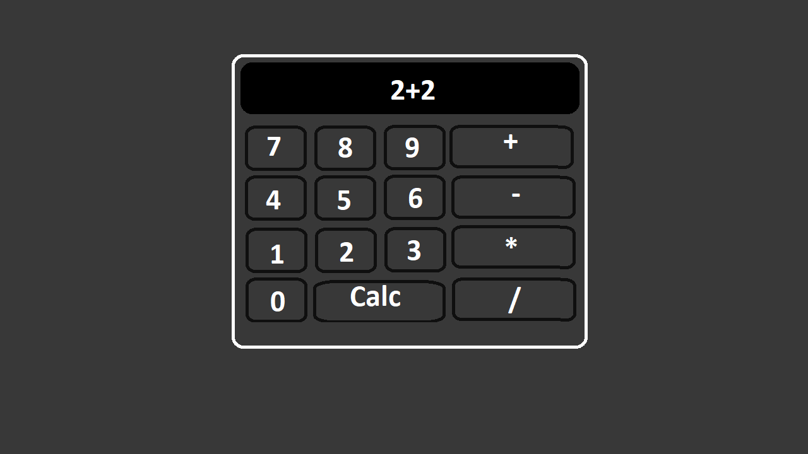

# Creación de un FrontEnd - Presentación del proyecto

Para comenzar intentaremos recrear una aplicación básica con React. Esta aplicación sera la creacion de un SPA, sin BackEnd. En el implementaremos una calculadora básica, en la que solo se trabajara con números enteros.

**Una posible plantilla a seguir sera la imagen que sigue.**



La aplicación estra constituida de un cuerpo central que contendra:
- Un display que muestra la operación y su resultado una vez calculado.
- 10 botones con un número entero asociado.
- 4 botones de operaciones (+,-,*,/).
- Un botón que lanza el calculo.

# Procedimiento.

Como este challenge sera importante para posteriores, no se realizara de una sola vez. En esta primera fase crearemos el visual de la aplicación. Para entender como crear elementos con React y darles estilos con CSS. En fases posteriores veremos como añadir las funcionalidades necesarias y como publicar nuestra aplicaión en la web.

Podemos partir de la `task_1` creada en el `challenge_5`, o simplemente crear una nueva con el nombre de `calculadora`.

> Para este primer proyecto no seran necesario añadir ningún paquete a mayores.

## Indice de las fases

- [Fase 0: Preparación](#fase-0-preparación-1707---2007)
- [Fase 1: Creación de la estética](#fase-1-creación-de-la-estética-2007---2207)
- [Fase 2: Creación de las funcionalidades](#fase-2-creación-de-las-funcionalidades-2207---2407)
- [Fase 3: Publicación](#fase-3-publicación-2407---2607)

## Fase 0: Preparación (17/07 - 20/07)

1. Limpiaremos los archivos creados para solo guardar los necesarios y asi partir de una base limpia.
    1. En `calculadora\index.html` cambiaremos el

        ```html
        <title>Vite + React</title>
        ```
        por
        ```html
        <title>Mi Calculadora</title>
        ```
    2. Modificaremos los archivos dentro de `calculadora\src` para obtener un resultado identico al de la carpeta `calculadora_template`
2. O copiad directamente la carpeta `calculadora_template` y cambiadle el nombre a `calculadora`.

## Fase 1: Creación de la estética (20/07 - 22/07)
En esta fase crearemos la estética de nuestra aplicación.

1. Crearemos la carpeta `calculadora\src\components`, dentro de ella crearemos una subcarpeta con el nombre de cada componente que crearemos.

    > Que es un componente?
    >> Un componente es simplemente cada objeto visual que surge de descomponer nuestro frontend en partes más pequeñas. En esta aplicación simple tendremos varios como por ejemplo, el `Body` de nuestra calculadora, el `Display` de la calculadora y los `Button` de la calculadora.

2. Crearemos la carpeta `Body` dentro de `components`. Y dentro de ella 2 archivos uno `index.jsx` que contendra nuestro código y `styles.module.css` que contendra los estilos del componente.

3. Dentro de `index.jsx`. Copiaremos este código.

    ```jsx
    /*
        Declaramos nuestros imports.
        Pueden ser otros componentes, estilos,
        paquetes, imagenes, archivos ...
    */
    import Button from '../Button'
    import Display from '../Display'
    import styles from './styles.module.css'

    /*
        La función principal de nuestro componente en ella
        se define el aspecto/estructura del componente que describe.
        Mediante una sintaxis similar a la del HTML5.
    */

    const Body = () => {
        return (
            <div className={styles.bodyContainer}>
                <div id={styles.cuerpo}>
                    <Display value={'2 + 2 = 4 -> LOL'}/>
                    <div id={styles.btnsContainer}>
                        <Button value='7'/>
                        <Button value='8'/>
                        <Button value='9'/>
                        <Button value='+'/>
                        <Button value='4'/>
                        <Button value='5'/>
                        <Button value='6'/>
                        <Button value='-'/>
                        <Button value='1'/>
                        <Button value='2'/>
                        <Button value='3'/>
                        <Button value='*'/>
                        <Button value='0'/>
                        <Button value='CALC'/>
                        <Button value='/'/>
                    </div>
                </div>
            </div>
        )
    }

    export default Body
    ```

4. Dentro de `styles.module.css`. Copiaremos este código.

    ```css
    .bodyContainer {
        width: 100%;
        height: 100vh;
        display: flex;
        flex-direction: column;
        justify-content: center;
        text-align: center;
    }

    #cuerpo {
        display: flex;
        flex-direction: column;
        justify-content: center;
        text-align: center;
        width: 50vw;
        margin: 0 auto;
        border: 0.4rem solid whitesmoke;
        border-radius: 2rem;
        padding: 2rem;
    }

    #btnsContainer {
        margin-top: 1rem;
        display: grid;
        grid-template-columns: 1fr 1fr 1fr 2fr;
        grid-template-rows: 1fr 1fr 1fr 1fr;
        gap: 1rem 1rem;
        grid-template-areas:
            ". . . ."
            ". . . ."
            ". . . ."
            ". calc calc .";
    }
    ```

5. Crearemos la carpeta `Display` dentro de `components`. Y dentro de ella 2 archivos uno `index.jsx` que contendra nuestro código y `styles.module.css` que contendra los estilos del componente.

6. Dentro de `index.jsx`. Copiaremos este código.

    ```jsx
    import styles from './styles.module.css'

    const Display = ({ value }) => {
        return (
            <div id={styles.displayContainer}>
                <p>{value}</p>
            </div>
        )
    }

    export default Display
    ```
    Vemos que la función `Display` recibe un objeto destruncturado `{ value }`, esta variable contiene lo que se le haya pasado desde el `Body` en su declaración `<Display value={'2 + 2 = 4 -> LOL'}/>`. El objeto destructurado puede contener multiples variables.

7. Dentro de `styles.module.css`. Copiaremos este código.

    :children_crossing: Como podemos ver en la declaración del `font-face` para este componente se usa una tipografia no estandar que se ha descargado desde [dafont.com](https://www.dafont.com/fr/calculator.font). Id a la carpeta `challenge_6\calculadora\src\assets` y copiad la carpeta `fonts` dentro de la vuestra.

    ```css
    @font-face {
        font-family: calculator;
        src: url(../../assets/fonts/calculator/Calculator.ttf);
    }

    #displayContainer {
        background-color: #1b1b1b;
        color: gainsboro;
        padding: 1rem;
        border-radius: 1rem;
        font-size: 3rem;
        font-weight: 600;
        font-family: calculator;
    }

    #displayContainer > p {
        text-align: justify;
    }
    ```

8. Crearemos la carpeta `Button` dentro de `components`. Y dentro de ella 2 archivos uno `index.jsx` que contendra nuestro código y `styles.module.css` que contendra los estilos del componente.

9. Dentro de `index.jsx`. Copiaremos este código.

    ```jsx
    import styles from './styles.module.css'

    const Button = ({ value }) => {
        return (
            <div className={value === 'CALC' ? `${styles.btns} ${styles.calc}` : styles.btns}>{value}</div>
        )
    }

    export default Button
    ```

10. Dentro de `styles.module.css`. Copiaremos este código.

    ```css
    .btns {
        background-color: gainsboro;
        border-radius: 1rem;
        padding: 1rem;
        box-shadow: 3px 3px gray;
    }

    .btns:hover {
        box-shadow: none;
        transform: translate(3px, 3px);
    }

    .calc {
        grid-area: calc;
    }
    ```

## Fase 2: Creación de las funcionalidades (22/07 - 24/07)

Retomaremos el desarrollo donde lo hemos dejado en la [Fase 1](#fase-1-creación-de-la-estética-2007---2207). En esta fase nos centraremos en finalizar nuestra aplicación, para ello tenemos que añadir las funcionalidades de los botones, la realización de los calculos y de mostrar el resultado.

> El código de la fase anterior ha sido modificado para poder añadir la funcionalidad de resetear la expresión a calcular. Para ello es necesasrio añadir un nuevo botón. Los los ficheros modificados son `src\components\Body\index.jsx` y `src\components\Body\styles.module.css`. Las modificaciones son visiblen a continuación.

Como he dicho en esta fase añadiremos las funcionalidades que seran:
- Mostrar la expresión a calcular actual.
- Cambiar la expresión cuando se pulse un botón.
- Calcular la extresión.
- Resetear la expresión.

Para esto cambiaremos los fichero para obtener el siguiente resultado:

- `components\Button\index.jsx`

    ```jsx
    import styles from './styles.module.css'

    /*
        action es una función que es pasada por el padre de Button
        y que es llamada en el onClick de este.
    */

    const Button = ({ value, action }) => {
        return (
            <div
                className={styles.btns}
                onClick={() => action()}
            >
                {value}
            </div>
        )
    }

    export default Button
    ```

- `components\Button\styles.module.css`

    ```css
    .btns {
        background-color: gainsboro;
        border-radius: 1rem;
        padding: 1rem;
        box-shadow: 3px 3px gray;
    }

    .btns:hover {
        box-shadow: none;
        transform: translate(3px, 3px);
    }

    /*
        El resto del código ha sido retirado porque ya no es útil.
    */
    ```

- `components\Body\index.jsx`

    ```jsx
    import { useState } from 'react'
    import Button from '../Button'
    import Display from '../Display'
    import styles from './styles.module.css'

    const Body = () => {

        /*
            Un useState se usa para definir una variable y una función que van logadas
            Estan hechas para que la variable sea un valor o un calculo parcial
            destinado a ser mostrado y que va a cambiar con el tiempo

            Para más información ver https://react.dev/reference/react/useState
        */
        const [expression, setExpression] = useState('0')

        /*
            Función que se pasa a un boton, resetea la expresión poniendola a 0.
        */
        const reset = () => {
            setExpression('0')
        }

        /*
            Función que se pasa a un boton, al ser pulsado este añade su valor
            asociado a la expresión.
        */
        const appendValue = (item) => {
            expression === '0' ? setExpression(item) : setExpression(expression.concat(item))
        }

        /*
            Función que se pasa a un boton, al ser pulsado este realiza el calculo de
            la expresión que deseamos calcular.
            Además de mostrar el resultado en el display.
        */
        const calc = () => {
            try {
                let resultado = eval(expression)
                setExpression(`${expression}=${resultado}`)
            } catch (error) {
                reset()
                console.error("Error: Operación inválida")
            }
        }

        /*
            A los botones se les pasa ahora un ``value`` asociado y una función ``action``
            que puede ser cualquier funcion posible, en nuestro caso se le pasa alguna
            de las funciones anteriores.
        */
        return (
            <div className={styles.bodyContainer}>
                <div id={styles.cuerpo}>
                    <Display value={expression} />
                    <div id={styles.btnsContainer}>
                        <Button value='7' action={() => appendValue('7')} />
                        <Button value='8' action={() => appendValue('8')} />
                        <Button value='9' action={() => appendValue('9')} />
                        <Button value='+' action={() => appendValue('+')} />
                        <Button value='4' action={() => appendValue('4')} />
                        <Button value='5' action={() => appendValue('5')} />
                        <Button value='6' action={() => appendValue('6')} />
                        <Button value='-' action={() => appendValue('-')} />
                        <Button value='1' action={() => appendValue('1')} />
                        <Button value='2' action={() => appendValue('2')} />
                        <Button value='3' action={() => appendValue('3')} />
                        <Button value='*' action={() => appendValue('*')} />
                        <Button value='0' action={() => appendValue('0')} />
                        <!-- Se ha añadido un nuevo boton para reseatear -->
                        <Button value='RESET' action={() => reset()} />
                        <Button value='CALC' action={() => calc()} />
                        <Button value='/' action={() => appendValue('/')} />
                    </div>
                </div>
            </div>
        )
    }

    export default Body
    ```

- `components\Body\styles.module.css`

    ```css
    .bodyContainer {
        width: 100%;
        height: 100vh;
        display: flex;
        flex-direction: column;
        justify-content: center;
        text-align: center;
    }

    #cuerpo {
        display: flex;
        flex-direction: column;
        justify-content: center;
        text-align: center;
        width: 50vw;
        margin: 0 auto;
        border: 0.4rem solid whitesmoke;
        border-radius: 2rem;
        padding: 2rem;
    }

    /*
        El resto del código ha sido modificado debido a la implementación
        de la función de reseteo.
    */

    #btnsContainer {
        margin-top: 1rem;
        display: grid;
        grid-template-columns: 1fr 1fr 1fr 2fr;
        grid-template-rows: 1fr 1fr 1fr 1fr;
        gap: 1rem 1rem;
        grid-template-areas:
            ". . . ."
            ". . . ."
            ". . . ."
            ". . . .";
    }
    ```

## Fase 3: Publicación (24/07 - 26/07)